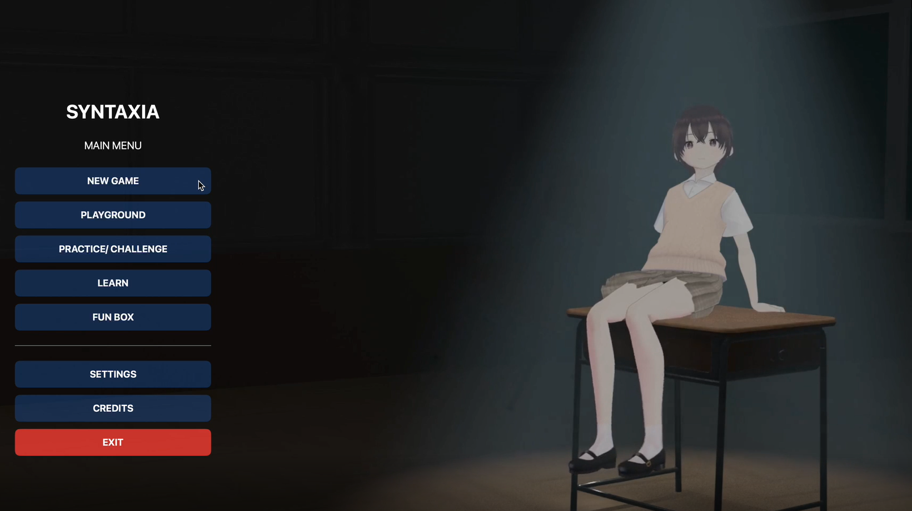

# WWDC25 Swift Student Challenge Submission - Syntaxia

Hi I'm jean and this is my submission for Swift Student Challenge 2025 ✨.

----

Source Code: https://github.com/JNX03/Syntaxia-WWDC-2025  
My portfolio : https://www.jnx03.xyz/

More about the Swift Student Challenge: https://developer.apple.com/swift-student-challenge/

### Submissions Data
###### Last update 23/02/2025 UTC+7 21:07
| Name | Source |    Video    | Technologies | Status |
|-----:|:------:|:-----------:|:-------------|:------:|
|[Jnx03](https://www.jnx03.xyz/)|[GitHub](https://github.com/JNX03/Syntaxia)|[Video](https://youtu.be/zJ4cAt7An84)|SwiftUI, Speech synthesis, Natural Language, Avfoundation , AVKit , AudioToolbox , Vision , UniformTypeIdentifiers , ScreenKit||

# Story
The character's name is "Syntaxia-chan", a high school student who faces problems as her classmate "Yuki-Ai chan", who gets sucked into the Matrix computer and loses her sanity. Her try to help but she can't she even't don't know how to programing but later on the discovery the headset that bring she to the internet world she connected to her and learning the basic of the python , swift  and facing many level to the last level she learn many of AI and manage to recovery Yuki Sanity back and everything end happyly

# Credit
All Assest create by me (  [@Jnx03](https://www.youtube.com/@Jnx03/videos)  ) Publish on  [@Jnx03Studio](https://www.youtube.com/@Jnx03Studio) 

#WWDC #Swift #SwiftStudentChallenge

